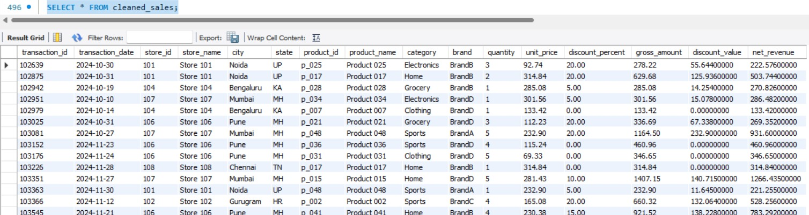
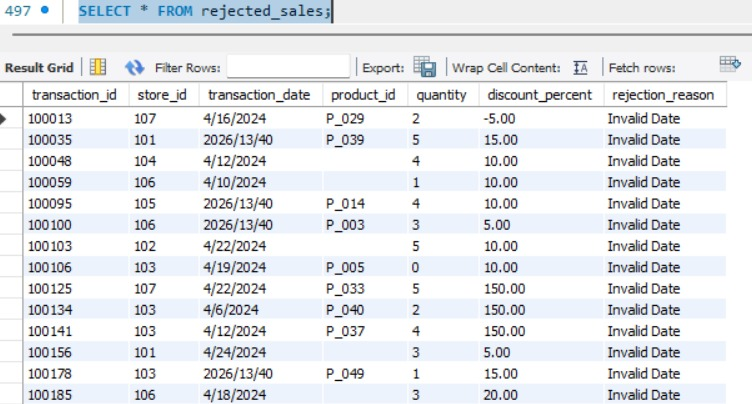
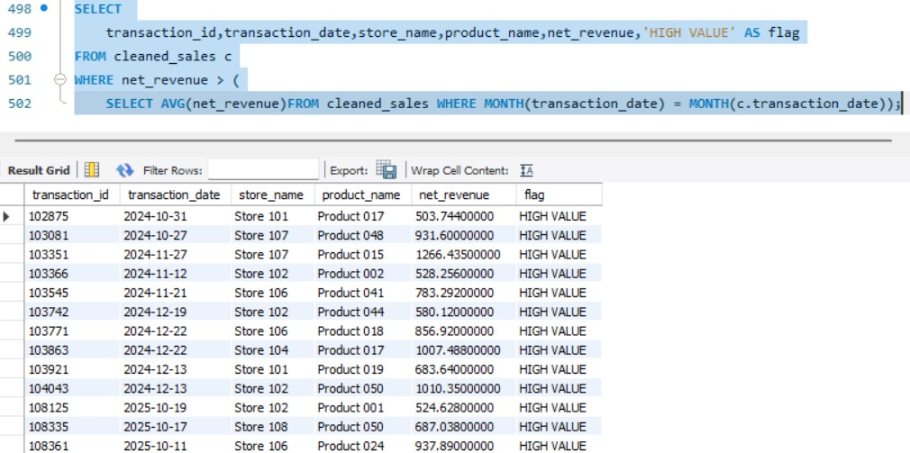

# ETL_Sales
# Sales ETL Project (IICS + SQL)

## Overview
This project demonstrates an end-to-end ETL (Extract, Transform, Load) pipeline using Informatica Intelligent Cloud Services (IICS) and SQL.

The objective is to process raw sales transaction data, clean and validate it, enrich it using master data, and generate meaningful business insights through KPI calculations.

---

## Project Objectives
- Clean and validate raw sales data  
- Separate valid and rejected records  
- Perform data enrichment using master tables  
- Calculate key business metrics (KPIs)  
- Generate analytical outputs  

---

## Datasets Used
- sales_transactions.csv (clean data)  
- sales_transactions_dirty.csv (dirty data)  
- product_master.csv  
- store_master.csv  

---

## ETL Pipeline Steps

### Step 1: Data Ingestion
- Loaded CSV files into IICS as source datasets  

### Step 2: Data Cleaning (Expression Transformation)
- Converted negative quantities to positive  
- Fixed discount values  
- Handled null values  
- Standardized data formats  

### Step 3: Data Validation (Router Transformation)
- Valid records stored in clean table  
- Invalid records stored in rejected table  

### Step 4: Data Enrichment (Joiner Transformation)
- Joined with Product Master and Store Master  

### Step 5: KPI Calculation (Expression)
- GROSS_AMOUNT = UNIT_PRICE × QUANTITY  
- DISCOUNT_VALUE = GROSS_AMOUNT × (DISCOUNT_PERCENT / 100)  
- NET_REVENUE = GROSS_AMOUNT - DISCOUNT_VALUE  

### Step 6: Data Loading
- Loaded processed data into FACT table  

---

## Tasks Implemented

### Task 1: Clean Sales Data
- Cleaned and standardized dirty transaction data  

### Task 2: Rejected Records
- Stored invalid records along with rejection reasons  

### Task 8: High Value Transactions
- Identified transactions where NET_REVENUE is greater than the average monthly revenue  

---

## Output Screenshots

### Task 1 Output (Cleaned Sales Data)

### Task 2 Output (Rejected Records)

### Task 8 Output (High Value Transactions)

---

## Tools and Technologies
- Informatica Intelligent Cloud Services (IICS)  
- SQL  
- GitHub  

---

## Key Learnings
- Built a complete ETL pipeline using IICS  
- Understood data validation and transformation  
- Worked with real-world data quality issues  
- Implemented KPI-based business analysis  

---

## Conclusion
This project demonstrates how raw transactional data can be transformed into structured and meaningful insights using ETL processes. It covers data cleaning, validation, enrichment, and KPI computation in a systematic manner.

---

## Author
- Atluri Aasritha
